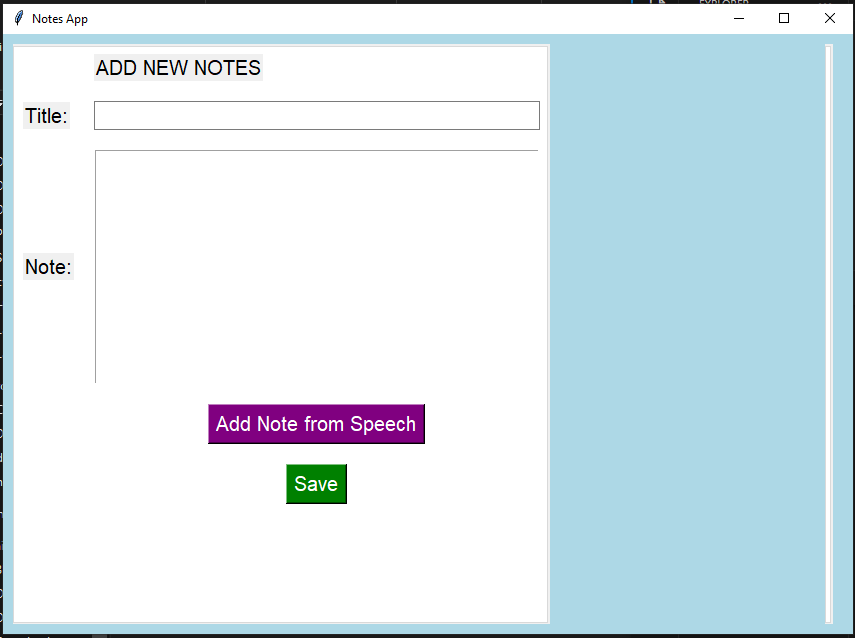
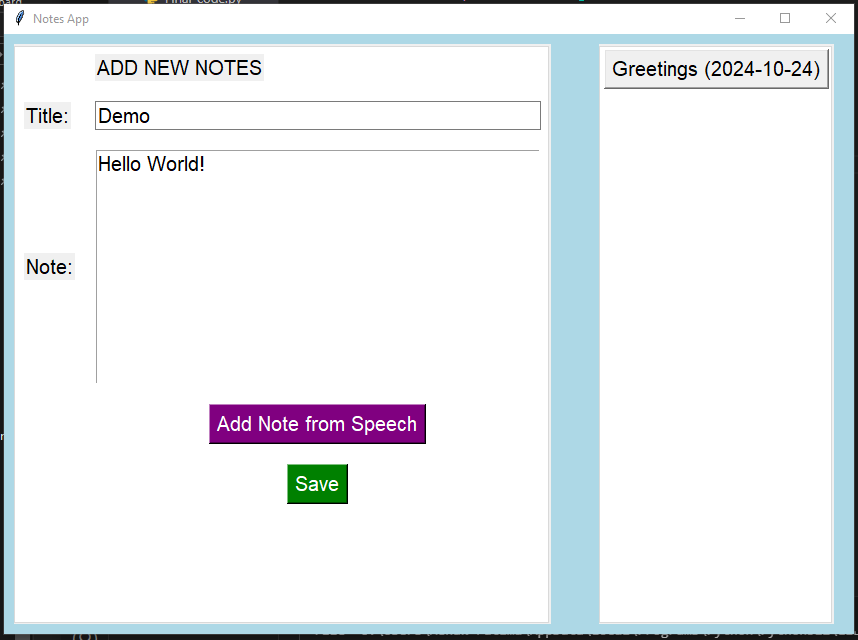
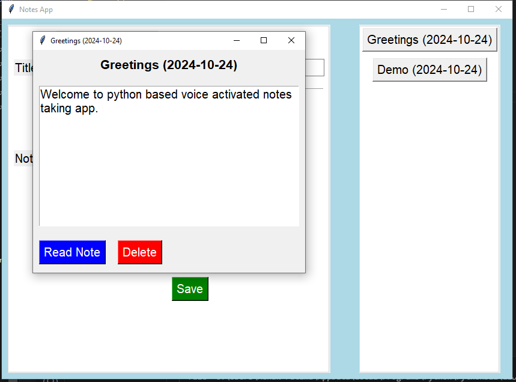

# Voice-activated-Note-taking-app
## Description
This voice-activated Notes App, built with Python and Tkinter, enables users to create, save, and manage notes efficiently. It features text-to-speech, speech-to-text, and easy deletion. Notes are automatically saved in a JSON file for persistence, ensuring a smooth user experience through an intuitive graphical interface.

## Key Features
1. **Add New Notes:** Create notes using text input or speech recognition.
2. **View Saved Notes:** Access all saved notes and creation dates.
3. **Delete Notes:** Remove notes with a simple confirmation dialog.
4. **Text-to-Speech:** Listen to saved notes using the built-in speech feature.
5. **Speech-to-Text:** Create notes from voice input using Google’s speech recognition API.
6. **Persistent Storage:** Notes are saved in a JSON file and loaded automatically when the app restarts.
   
## Requirements
Python 3.x  

**Install the following dependencies:**  
pip install pyttsx3 SpeechRecognition

## Usage  
To run the app, use the following command:  
python notes_app.py

## Screen Shots  
**Notes app**  

**Adding Notes**  

**Viewing Note**  

